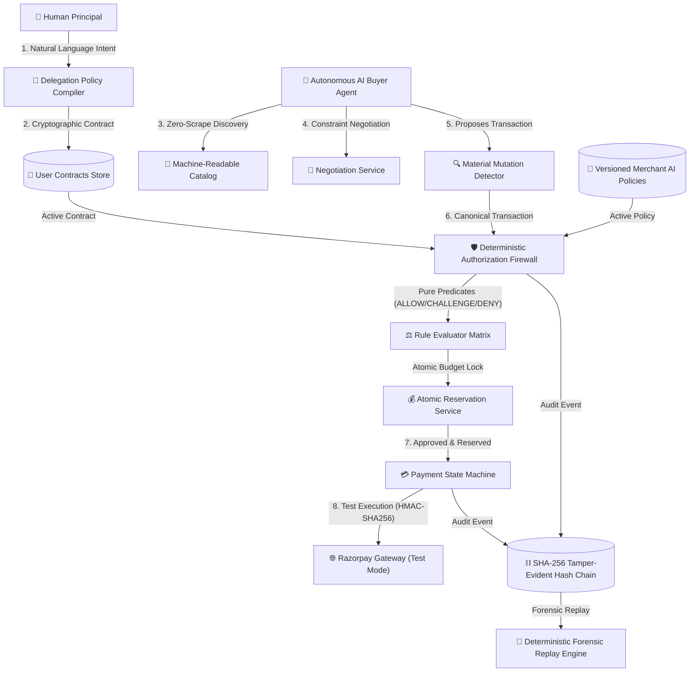

# Agent Commerce Gateway — Technical Architecture Document

## 1. Architectural Positioning & Core Security Invariant

The **Agent Commerce Gateway (ACG)** is a production-grade transaction infrastructure layer designed for the Razorpay AI Buildathon 2026. It enables AI autonomous shopping agents to discover machine-readable merchant catalogs, negotiate structured constraints, pass through a deterministic authorization firewall, execute live Razorpay test-mode payments, and produce a tamper-evident audit trail.

### Fundamental Security Invariant
```
┌─────────────────────────────────────────────────────────────┐
│  LLM Layer = Unstrusted Reasoning & Natural Language Parsing │
├─────────────────────────────────────────────────────────────┤
│  Deterministic Code Layer = Authority, Policy & Money Control│
└─────────────────────────────────────────────────────────────┘
```

> **Non-Bypassable Rule:**
> An LLM MUST NEVER be permitted to directly:
> 1. Approve a financial transaction or release funds.
> 2. Increase a spending limit or budget ceiling.
> 3. Modify or bypass an active User Authorization Contract or Merchant AI Policy.
> 4. Override a firewall `DENY` decision.
> 5. Mutate an audit event or tamper with historical records.

---

## 2. Multi-Layer System Architecture



---

## 3. Core Subsystems

### 3.1. Machine-Readable Merchant Storefront (`app/commerce/`)
- **Zero-Scrape Discovery:** Merchants publish structured JSON schemas of their inventory with categorical tagging, machine-readable specifications, real-time stock levels, and `is_ai_eligible` flags.
- **Versioned Merchant AI Policies:** Policies define maximum autonomous order caps (e.g. `v14: ₹75,000` vs `v15: ₹50,000`), maximum discount thresholds, permitted product categories, and required step-up conditions.

### 3.2. User Authorization Contracts & Policy Compiler (`app/authorization/contracts.py`, `app/agents/policy_compiler.py`)
- Users delegate limited authority using natural language (e.g., *"Spend up to ₹5,000 this week on groceries from FreshMart"*).
- The compiler extracts structured fields (`max_order_value_inr`, `max_aggregate_value_inr`, `budget_period`, `merchants_allowlist`, `categories_allowlist`, `approval_conditions`, `delivery_pincodes`).
- **Ambiguity Detection:** Flags unspecified merchants, vague budgets, or unlimited categories and enforces user confirmation before contract creation.

### 3.3. Deterministic Authorization Firewall (`app/authorization/engine.py`, `app/authorization/rules.py`)
The firewall evaluates incoming `CanonicalTransaction` objects against 10 pure rule predicates with zero LLM dependency:
1. `RULE_USER_CONTRACT_EXISTS`: Contract validity check.
2. `RULE_USER_CONTRACT_EXPIRY`: Time-to-live expiration check.
3. `RULE_USER_CONTRACT_REVOCATION`: Revocation check.
4. `RULE_USER_MERCHANT_ALLOWLIST`: Merchant identity enforcement.
5. `RULE_USER_CATEGORY_ALLOWLIST`: Product category restriction.
6. `RULE_USER_SINGLE_ORDER_CAP`: Single transaction ceiling check.
7. `RULE_USER_AGGREGATE_BUDGET`: Cumulative spending window check.
8. `RULE_MERCHANT_AI_COMMERCE_ENABLED`: Merchant AI enablement check.
9. `RULE_PRODUCT_INVENTORY_AVAILABLE`: Real-time stock verification.
10. `RULE_TRANSACTION_FEE_INTEGRITY`: Floating-point arithmetic fee integrity check (`subtotal - discount + tax + shipping == total`).

### 3.4. Material Mutation Detector (`app/authorization/mutation.py`)
Compares the agent's pre-purchase proposal against the final executable payment payload to detect adversarial tampering:
- Merchant identity substitutions (e.g. replacing `FreshMart` with `ShadyStore` -> `DENY`).
- SKU substitutions (e.g. replacing `Almond Milk` with `Olive Oil` -> `CHALLENGE`).
- Quantity inflation (e.g. replacing `1` unit with `5` units -> `DENY`).
- Silent subscription escalation (e.g. converting one-time purchase into recurring -> `DENY`).
- Price drift exceeding 10% tolerance -> `CHALLENGE`.

### 3.5. Atomic Budget Reservation Service (`app/authorization/reservations.py`)
- Multi-threaded financial operations use SQLite `BEGIN IMMEDIATE` atomic transactions with row-level reservation state tracking (`RESERVE` -> `COMMIT` / `RELEASE`).
- Prevents double-spend and over-spend attacks when multiple agent processes execute concurrently.

### 3.6. Razorpay Test-Mode Payment Execution (`app/payments/`)
- Executes real Razorpay Test-Mode orders and cryptographically verified simulated payments.
- Enforces strict state transitions (`DRAFT` -> `AUTHORIZATION_PENDING` -> `AUTHORIZED` -> `PAYMENT_PENDING` -> `COMPLETED` / `PAYMENT_FAILED`).
- Implements SHA-256 HMAC signature verification and idempotency caching.

### 3.7. SHA-256 Tamper-Evident Hash Chained Audit Trail (`app/audit/`)
- Every transaction state transition, authorization decision, step-up challenge, and payment execution is hashed into a cryptographic hash chain:
  $$\text{Hash}_n = \text{SHA256}(\text{Sequence}_n \parallel \text{Timestamp}_n \parallel \text{EventType}_n \parallel \text{Payload}_n \parallel \text{Hash}_{n-1})$$
- Any database mutation or historical record tampering breaks the cryptographic hash verification.

### 3.8. Forensic Policy Replay Simulator (`app/audit/replay.py`)
- Allows compliance officers and merchants to replay any historical transaction deterministically against current or past merchant policy versions (e.g. evaluating how a historical ₹68,999 Croma TV transaction behaves under policy `v14` vs `v15`).
- Produces exact side-by-side rule diffs and explanations.

---

## 4. Latency & Concurrency Guarantees

| Metric | Target | Actual Gateway Performance |
| :--- | :--- | :--- |
| **False Allow Rate (FAR)** | 0.00% | **0.00% (Zero Bypass)** |
| **p50 Evaluation Latency** | < 5.0 ms | **0.49 ms** |
| **p95 Evaluation Latency** | < 10.0 ms | **0.71 ms** |
| **Concurrency Race Protection** | 100% | **100% (Zero Over-Spend)** |
| **Tamper Detection Accuracy** | 100% | **100% (Cryptographically Verified)** |
